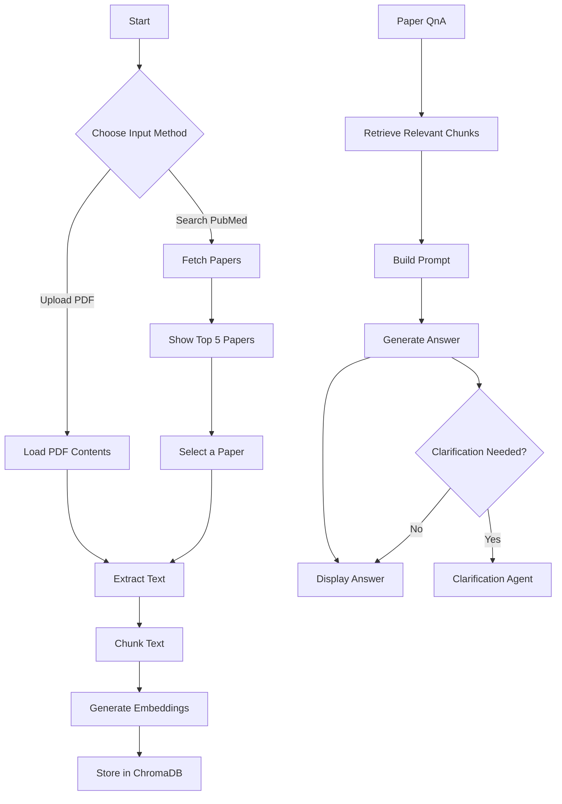

# Research-Paper-Copilot
LLMs, agents, RAG, embeddings, and real-world use.

A multi-agent system that lets you **search PubMed for research papers**, **upload a research paper (PDF)** and **ask questions** about it!
Built with **Streamlit** for UI, **ChromaDB** for vector storage, and a modular **Agentic Architecture** for document understanding.

---

## Features
- Extract papers from the web via PubMed API based on search query
- Select wanted paper for further QnA
- Upload PDF research papers
- Automatic PDF loading, text chunking, and embeddings generation
- Store embeddings in ChromaDB for fast retrieval
- Gives a brief summary of the uploaded document/paper from PubMed
- Query over document content using LLM-based reasoning
- Modular agent system for easy extensions
- Clarification agent when no direct answer is found

---

## How It Works

1. Upload a PDF via Streamlit app or Search for papers on PubMed directly through the app.
2. Extract text from the uploaded PDF (pdf_loader_agent) or fetch text from a selected PubMed paper (pubmed_agent).
3. Preview top 5 papers from PubMed search results and select one for deeper question-answering.
4. Chunk the text into intelligently sized pieces for better retrieval quality.
5. Generate embeddings for all text chunks using an embeddings model.
6. Store embeddings inside ChromaDB vector database for efficient similarity search.
7. Ask a question about the paper/document.
8. Retrieve relevant chunks from ChromaDB based on semantic similarity to your question.
9. Build a context-rich prompt combining your query and the retrieved document pieces.
10. Generate an answer using an LLM based on the constructed context.
11. (Optional): If no direct answer is found, a Clarification Agent attempts to help refine the question.

### Flowchart
This uses [Mermaid](https://mermaid-js.github.io/mermaid/#/) diagrams


---

## Tech Stack

- **Python 3.12+**
- **Streamlit** (Frontend UI)
- **ChromaDB** (Vector database)
- **Langchain / Gemini** (for response generation)
- **Huggingface Sentence Transformers** (for embedding)
- Modular custom **Agents**

---

## Setup Instructions

1. **Clone the Repository**

```bash
git clone https://github.com/RishabhSpark/Research-Paper-Copilot.git
```

2. **Install dependencies with poetry**
Install poetry (if you don't have it already)
```bash
Install Poetry
```

Install dependencies
```bash
poetry install
```

3. Run the app
- Using streamlit (for UI)
```bash
streamlit run app/ui/main_app.py
```

- (or) Using python (only pdf upload supported)
```bash
python main.py
```
