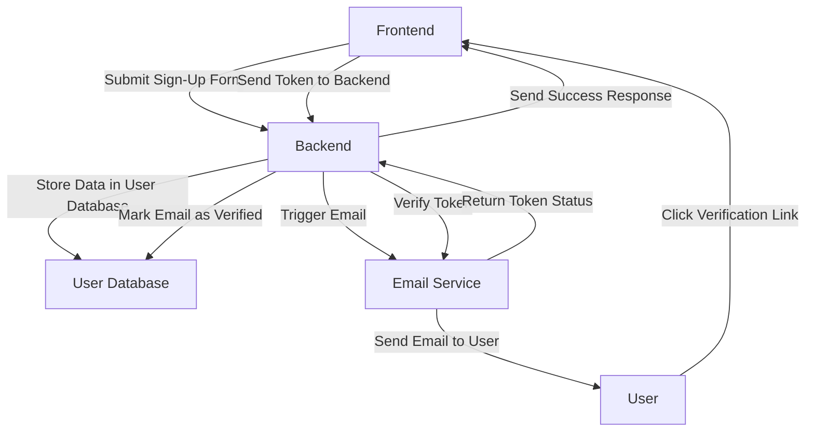

# System Architecture Overview

This document provides an overview of the system architecture, detailing the major components, data flows, and key constraints to ensure the system is well-understood by all team members.

---

### **1. Major Components**

#### **Frontend**
The frontend is the user-facing part of the application. It is responsible for:
- Collecting user inputs via forms (e.g., sign-up, login).
- Displaying UI elements and messages based on user actions and system responses.
- Making API calls to the backend to retrieve data and trigger operations.

**Technologies Used**:
- React.js
- CSS, HTML, JavaScript

---

#### **Backend**
The backend handles business logic, data processing, and communication between the frontend and databases. It is responsible for:
- Handling incoming HTTP requests from the frontend (e.g., sign-up, email verification).
- Validating user inputs and processing data.
- Interacting with external services (e.g., email service for verification).
- Serving APIs for frontend consumption.

**Technologies Used**:
- FastAPI
- Python
- REST APIs

---

#### **User Database**
The user database stores all the user information, including:
- User credentials (passwords are encrypted).
- Email verification status.
- User preferences and activity logs.

**Technologies Used**:
- PostgreSQL
- SQLAlchemy ORM

---

#### **Email Service**
The email service is responsible for sending verification emails to users. It interacts with the backend to:
- Receive email requests from the backend.
- Send verification emails with a unique token to users.
- Handle retries and delivery failures.

**Technologies Used**:
- SMTP (Simple Mail Transfer Protocol)
- Third-party services like SendGrid or Amazon SES

---

### **2. Data Flow**

1. **User Sign-Up Flow**:
    - The user submits a sign-up form (username, password, email) via the frontend.
    - The frontend sends the form data to the backend.
    - The backend stores user data in the user database.
    - The backend triggers the email service to send a verification email to the user.
    - The frontend displays a success message to the user.
    
2. **Email Verification Flow**:
    - The user clicks the verification link received in their email.
    - The frontend sends the token to the backend for verification.
    - The backend validates the token using the email service.
    - If valid, the backend marks the email as verified in the database and informs the frontend.
    - The frontend updates the UI with a success message.

---

### **3. Key Constraints**

- **Email Delivery Reliability**: The system relies on the availability and reliability of the external email service for delivering verification emails. Any downtime in the email service may impact user registration.
  
- **Data Integrity**: The system must ensure that user data is securely stored and that no duplicate or invalid data is saved in the database (e.g., verifying email uniqueness).
  
- **Scalability**: The system should be scalable to handle a growing number of users and email verification requests, especially if third-party services are used for email delivery.

- **Security**: User passwords are hashed and encrypted. The system should adhere to best practices for security, including rate-limiting requests to avoid brute-force attacks during the sign-up or verification process.

---

### **4. Diagram**

Here’s an architecture diagram to visualize the system flow and interaction between components:

