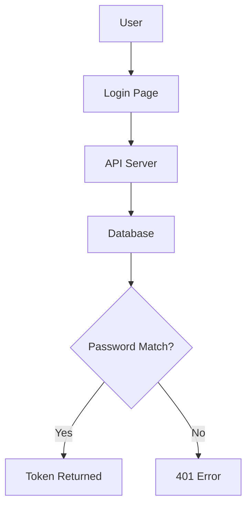

# Login Flow Diagram

```mermaid
flowchart TD
    A[User] --> B[Login Page]
    B --> C[API Server]
    C --> D[Database]
    D --> E{Password Match?}
    E -- Yes --> F[Token Returned]
    E -- No --> G[401 Error]
```