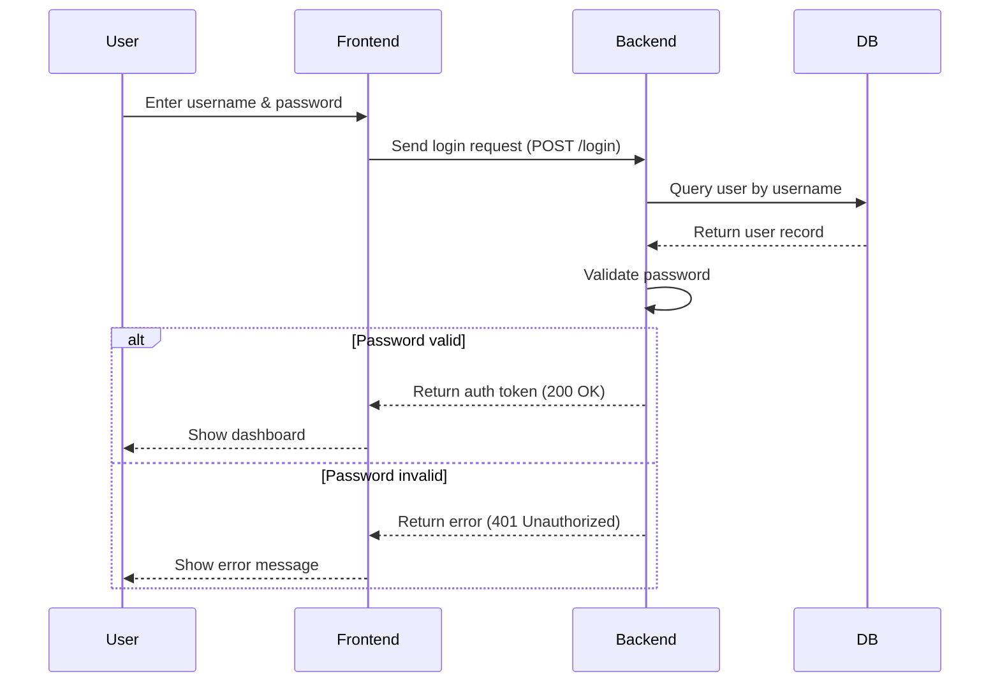

# Login Flow Sequence Diagram (Mermaid.js)
This uses [Mermaid](https://mermaid-js.github.io/mermaid/#/) diagrams

Below is a Mermaid.js sequence diagram for a typical login flow.

```mermaid
sequenceDiagram
    participant User
    participant Frontend
    participant Backend
    participant DB

    User->>Frontend: Enter username & password
    Frontend->>Backend: Send login request (POST /login)
    Backend->>DB: Query user by username
    DB-->>Backend: Return user record
    Backend->>Backend: Validate password
    alt Password valid
        Backend-->>Frontend: Return auth token (200 OK)
        Frontend-->>User: Show dashboard
    else Password invalid
        Backend-->>Frontend: Return error (401 Unauthorized)
        Frontend-->>User: Show error message
    end
```

---
