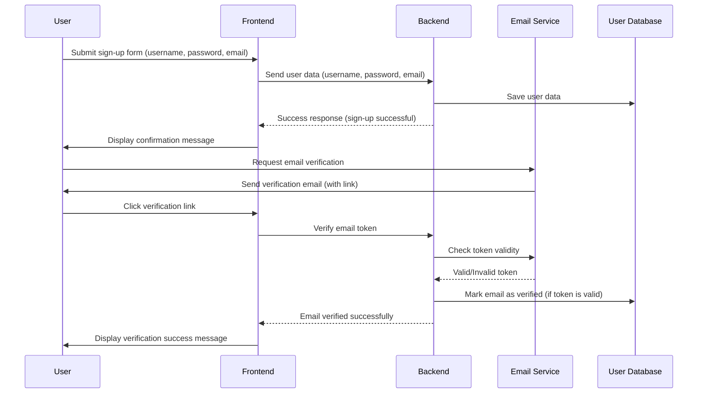

```mermaid
sequenceDiagram
    participant User as User
    participant Frontend as Frontend
    participant Backend as Backend
    participant EmailService as Email Service
    participant UserDatabase as User Database

    User->>Frontend: Submit sign-up form (username, password, email)
    Frontend->>Backend: Send user data (username, password, email)
    Backend->>UserDatabase: Save user data
    Backend-->>Frontend: Success response (sign-up successful)
    Frontend->>User: Display confirmation message

    User->>EmailService: Request email verification
    EmailService->>User: Send verification email (with link)
    User->>Frontend: Click verification link
    Frontend->>Backend: Verify email token
    Backend->>EmailService: Check token validity
    EmailService-->>Backend: Valid/Invalid token
    Backend->>UserDatabase: Mark email as verified (if token is valid)
    Backend-->>Frontend: Email verified successfully
    Frontend->>User: Display verification success message
```