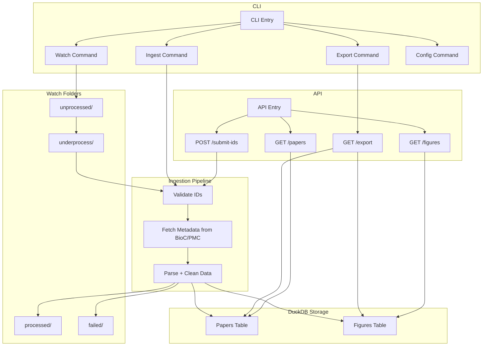

# Figure Caption App

## High-Level Overview

The system is designed to extract, process, store, and serve metadata from scientific publications (specifically from PubMed Central). It supports both automated ingestion (via folder watcher, file, or a list and can be run using CLI) and query-based access (via a password-protected API). The architecture supports modularity, testability, and production readiness.

## Architecture Layers

### 1. Ingestion Layer
- Sources: PMC IDs (via CLI, JSON/CSV/TXT file, or watched folder)
- Handler: ingest_pipeline.py
- Fetches metadata (title, abstract, figures) using external APIs (e.g., BioC)

### 2. Processing Layer
- Extracts metadata fields (title, abstract) and figure captions
- Identifies key entities for each figure

### 3. Storage Layer
- Writes metadata to DuckDB
- Tables: papers, figures
- Accessed by ingestion, export, and API modules

### 4. Export Layer
- CLI tool to export stored metadata to CSV or JSON

### 5. API Layer
- FastAPI-based REST interface
- Protected by an API key
- Exposes endpoints to fetch papers, figures, paper metadata, export, submit pmc ids (to ingest)
  
### Utilities
- Logging system (get_logger)
- Config management (load_config)

## Data Flow Diagram


## Ingestion Pipeline Diagram
```mermaid
flowchart TD
    A["Start: Accept list of IDs"] --> B["Call BioC API"]
    B --> C["Parse BioC structure"]
    C --> D["Extract figure captions"]
    D --> E["Call PubTator API"]
    E --> F["Extract entities from captions"]
    F --> G["Store in DuckDB Normalized Schema"]
    G --> H["Log Summary and Debug Logs"]
    H --> I{"Success?"}
    I -- Yes --> J["Exit with Code 0"]
    I -- No --> K["Exit with Code 1"]
  ```

## Running with Docker & Makefile

This guide explains how to build and run the `paper-metadata-app` using the provided `Makefile` and `Dockerfile`.

---

### Prerequisites
- Docker installed and running
- `make` command available (commonly pre-installed on Linux/macOS)
- Project directory contains:
  - `Makefile`
  - `Dockerfile`
  - `requirements.txt`
  - `main.py` and `src/` directory with FastAPI app

---

### Step 1: Git clone
```bash
git clone https://github.com/RishabhSpark/bootcamp.git
```
#### Step 2: Go to folder
```bash
cd figure-caption-extraction
```

### Step 3: Build the Docker Image

This step creates a Docker image tagged as `paper-metadata:latest`.

```bash
make docker-build # under the hood this run `docker build -t paper-metadata:latest .`
```

### Step 4: Run the CLI Tool
To run the CLI version (e.g., main.py --help) inside the Docker container:

```bash
make docker-cli # under the hood this runs `docker run --rm -it paper-metadata:latest python main.py --help`
```

### Step 5: Run the FastAPI Server
To start the FastAPI app using Uvicorn inside Docker:

```bash
make docker-api # under the hood this runs `docker run -p 8000:8000 paper-metadata:latest uvicorn src.api.main:app --host 0.0.0.0 --port 8000`
```

Then open your browser or use curl:
`http://localhost:8000/` or `curl http://localhost:8000/`

Docs should be available at:
- http://localhost:8000/docs (Swagger UI)
- http://localhost:8000/redoc (ReDoc)

### Additional Notes
- The Makefile abstracts away Docker commands for easier usage.
- The Dockerfile uses Python 3.13-slim and installs dependencies from requirements.txt.
- If you need to rebuild after changes, run: `make docker-build`


### Available make targets: `make help`
To check the make targets run:
```bash
make help
```

```bash
Available targets:
  docker-build   # Build the Docker image
  docker-cli     # Run the CLI inside Docker
  docker-api     # Run the FastAPI server inside Docker
```

## Using the CLI
You can access the cli by main.py


## Folder Structure

```
├── Dockerfile                      # Docker
├── Makefile                        # To build the docker file and cli
├── README.md                       # This readme file, with all info
├── data                            # Data folder, has the extracted data
│   └── papers.duckdb               # Has papers and figures table
├── export                          # Export path
│   ├── csv                         # csv exports
│   │   ├── figures.csv
│   │   └── papers.csv
│   └── json                        # json exports
│       ├── figures.json
│       └── papers.json
├── ingest                          # Import path
│   ├── file                        # Import from file, supports csv, txt, and json
│   │   ├── pmc_ids.csv
│   │   └── pmc_ids.txt
│   └── watch_folder                # Watched folder
│       ├── failed
│       ├── processed
│       │   ├── pmc_ids_1.txt
│       │   └── pmc_ids_2.txt
│       ├── underprocess
│       └── unprocessed
├── logs                            # For saving logs
│   └── app.log                     # log file
├── main.py                         # CLI entrypoint
├── requirements.txt                # Requirements for this
└── src                             # Main codebase
    ├── api                         # FastAPI
    │   ├── auth.py
    │   └── main.py
    ├── cli                         # CLI Interfact
    │   ├── batch_ingest.py         # For batch ingestion
    │   ├── cli.py                  # Running the app
    │   ├── commands
    │   │   ├── config.py           # To check configs
    │   │   ├── export.py           # Export to csv, json
    │   │   ├── ingest.py           # Ingest from file/terminal
    │   │   └── watch.py            # Watch cli
    │   └── watch_folder.py         # Watch folder logic
    ├── config                      # Config files
    │   ├── config.yaml             # Edit this for changing configs
    │   └── config_loader.py
    ├── ingestion                   # PubMed logic
    │   ├── bioc_fetcher.py         # Fetches papers and extracts title, abstract, figures
    │   └── ingest_pipeline.py      # Pipeline
    │   └── pmcid_to_pmid.py        # Converts pmcid to pmid
    │   └── pubtator_fetcher.py     # Fetches entities using Pubtator3
    ├── models                      # Pydantic models
    │   ├── AppConfig.py            # Config
    │   ├── FigureData.py           # Figure data
    │   ├── PaperData.py            # Paper data
    │   ├── PaperIDRequest.py
    ├── storage                     # Database writer folder
    │   └── duckdb_writer.py
    └── utils                       # Utils
        └── logger.py               # logger
```

### How to use cli
This makes the docker-cli and shows the help for cli
```
make docker-cli
```

Now, we can use this `docker run --rm -it paper-metadata:latest python main.py` to run the cli

CLI has 4 commands:
- ingest
  -  has `file` and `list` command. 
  -  `file`: Takes `file_path`. Can be a csv, txt, or json file. Example, `python main.py ingest file ingest/file/pmc_ids.txt`
  -  `list`: Takes a list of pmcids
- export
  - takes `csv` and `json` command
  - `csv`: Exports the papers and figures database to csv by using options `--output-dir`. Example, `python main.py export csv --output-dir export/csv/`
  - `json`: Exports the papers and figures database to json by using options `--output-dir`. Example, `python main.py export json --output-dir export/json/`
- watch
  - takes `watch` as an argument, it has `--base-dir` as an option which is the watch folder. Example, `python main.py watch watch --base-dir ingest/watch_folder/`
- config
  - prints the configs to the terminal
  
### How to use API

`make docker-api` makes the API and runs it

#### Endpoints
- "GET /papers": "List all paper metadata",
- "GET /figures": "List all figure metadata",
- "POST /submit-ids": "Submit list of PMCIDs to ingest",
- "GET /export": "Export data in CSV or JSON format",
- "Docs": "/docs"